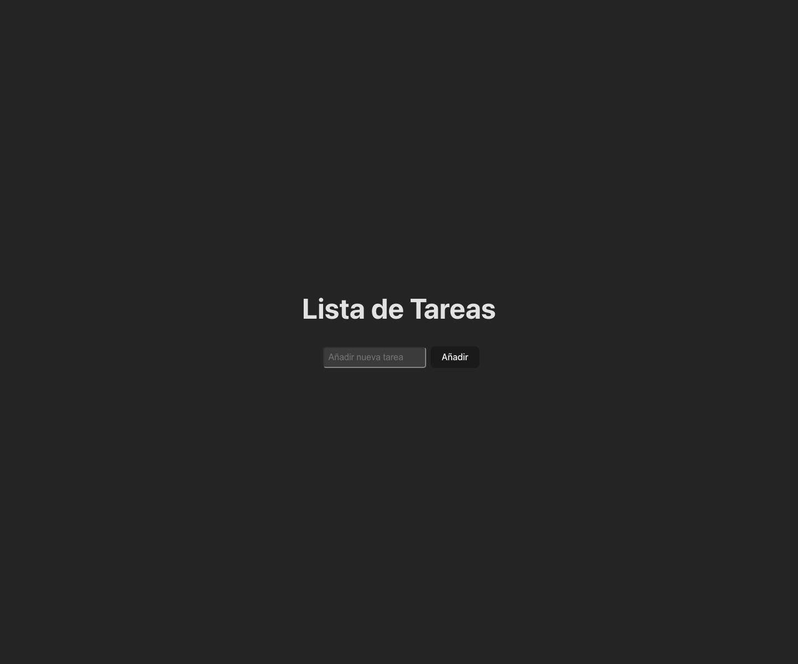

# Lista de Tareas - Testing con Vitest

Aplicación React/Vite de lista de tareas creada como evidencia SENA para practicar pruebas con **Vitest** y **Testing Library**.

<p align="center">
  
</p>

## Resumen

El proyecto implementa una to-do app simple con formulario para añadir tareas y suite de pruebas automatizadas para validar el comportamiento principal del componente.

## Características

- Interfaz de lista de tareas en React.
- Formulario para agregar nuevas tareas.
- Componentes separados para formulario y listado.
- Pruebas con Vitest y Testing Library.
- Configuración de entorno de pruebas con jsdom.
- Build con Vite.

## Stack

- React 18
- Vite 4
- Vitest
- Testing Library
- jsdom
- ESLint

## Instalación

```bash
npm ci
npm run dev
```

Abrí `http://localhost:5173` o el puerto que indique Vite.

## Testing

```bash
npm test -- --run
npm run coverage
```

## Validación Local

La imagen del README fue tomada desde la app ejecutándose en `http://127.0.0.1:3018`.

Comandos validados:

```bash
npm ci
npm test -- --run
npm run build
npm run dev -- --host 127.0.0.1 --port 3018
```

Resultado de pruebas: **1 archivo de test aprobado, 3 tests aprobados**. Build finalizado correctamente.

## Estructura Relevante

```text
src/App.jsx              # Componente principal
src/App.test.jsx         # Tests de comportamiento
src/components/          # TodoForm y TodoList
src/test/setup.js        # Setup de Testing Library
vite.config.js           # Configuración Vite/Vitest
```
